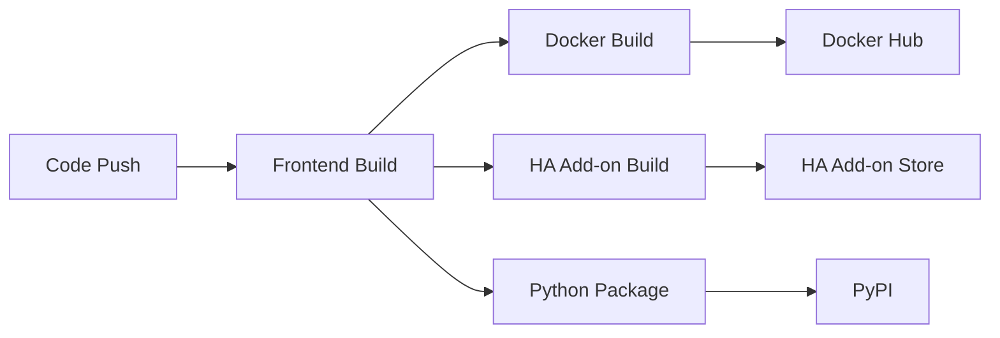

# 🔄 Deployment Synchronization Strategy

This document outlines how we keep all three deployment options (Home Assistant add-on, Docker container, and Python package) synchronized and up-to-date during development.

## 🏗️ Shared Foundation

### Core Components (Always Synchronized)
- **Backend Service**: `src/aquarium_device_manager/` - Same FastAPI service across all deployments
- **Frontend Build**: `frontend/dist/` - Single TypeScript build shared by all
- **Device Management**: BLE service and device classes are identical
- **Configuration System**: Environment-aware config paths for different deployments

### Deployment-Specific Files
```
.
├── src/                          # ✅ Shared: Core Python service
├── frontend/                     # ✅ Shared: TypeScript frontend
├── docker/                       # 🐳 Docker-specific files
│   ├── Dockerfile                #    Multi-stage build
│   ├── docker-compose.yml        #    Complete stack
│   └── README.md                 #    Docker setup guide
├── hassio/                       # 🏠 Home Assistant add-on
│   ├── config.yaml               #    HA add-on configuration
│   ├── Dockerfile                #    HA-specific wrapper
│   ├── run.sh                    #    HA startup script
│   └── README.md                 #    HA add-on guide
└── scripts/                      # 🔧 Development tools
    ├── build-all.sh              #    Build all deployments
    └── dev-env.sh                #    Unified dev environment
```

## 🔄 Synchronization Mechanisms

### 1. Automated CI/CD Pipeline
**File**: `.github/workflows/build-deploy.yml`



**Process**:
1. **Frontend Build**: Single build step creates `frontend/dist/`
2. **Artifact Sharing**: Frontend artifacts shared across all deployment builds
3. **Multi-Platform**: Each deployment builds for all supported architectures
4. **Version Sync**: All deployments use same version tags from git

### 2. Shared Docker Base
**Strategy**: Both Docker and HA add-on use the same base image

```dockerfile
# docker/Dockerfile - Master build
FROM node:18-alpine AS frontend-builder
# ... build frontend

FROM python:3.11-slim AS runtime
# ... install dependencies, copy code
```

```dockerfile
# hassio/Dockerfile - Inherits from Docker build
COPY --from=aquarium-device-manager:latest /app /app
# ... HA-specific configuration only
```

### 3. Environment-Aware Configuration
**File**: `src/aquarium_device_manager/config_migration.py`

```python
def get_config_dir() -> Path:
    """Auto-detect deployment environment and return appropriate config path."""
    if os.getenv("HASSIO_TOKEN"):          # Home Assistant
        return Path("/data")
    elif os.getenv("DOCKER_CONTAINER"):    # Docker
        return Path("/app/data")
    else:                                  # Local installation
        return Path.home() / ".aqua-ble"
```

### 4. Unified Development Environment
**File**: `scripts/dev-env.sh`

- **Single command** to set up development for all deployments
- **Shared environment variables** across all deployment types
- **Consistent data paths** for testing

## 🧪 Development Workflow

### Daily Development
1. **Edit core code** in `src/` or `frontend/`
2. **Test locally** with `make dev` or `python -m src.aquarium_device_manager.service`
3. **Test Docker** with `docker-compose -f docker/docker-compose.yml up`
4. **Test HA add-on** by copying `hassio/` to HA development environment

### Release Process
1. **Version bump** in `pyproject.toml`, `hassio/config.yaml`, and CI
2. **Create git tag** (`v1.x.x`)
3. **CI automatically builds and deploys**:
   - Docker images to GitHub Container Registry
   - HA add-on to add-on repository
   - Python package to PyPI

### Validation Points
- ✅ **Frontend**: Same `npm run build` output used by all
- ✅ **Backend**: Same Python service with environment-aware paths
- ✅ **Health Check**: `/api/health` endpoint works in all deployments
- ✅ **Bluetooth**: Same BLE service with deployment-appropriate permissions

## 🔧 Keeping Deployments Current

### Automated Synchronization
- **CI/CD Pipeline**: Builds all deployments on every commit/tag
- **Shared Artifacts**: Frontend build shared across all Docker builds
- **Version Tagging**: Git tags automatically propagate to all deployments

### Manual Synchronization Checks
```bash
# Build and test all deployments locally
./scripts/build-all.sh

# Set up unified development environment
source ./scripts/dev-env.sh

# Test each deployment:
make dev                                              # Local
docker-compose -f docker/docker-compose.yml up       # Docker
# Copy hassio/ to HA and test                        # Home Assistant
```

### Configuration Drift Prevention
- **Environment variables**: Documented in README with examples for each deployment
- **Configuration schema**: HA add-on schema validates configuration options
- **Health checks**: Consistent across all deployments for monitoring

## 📋 Maintenance Checklist

When adding new features:

- [ ] **Core functionality** added to `src/aquarium_device_manager/`
- [ ] **Frontend changes** made in `frontend/src/` and tested
- [ ] **Environment variables** documented in all README files
- [ ] **Docker health check** updated if needed
- [ ] **HA add-on config** updated if new options added
- [ ] **CI/CD pipeline** tested with build-all script
- [ ] **Version numbers** updated in all deployment configs
- [ ] **Documentation** updated for all deployment methods

This strategy ensures that regardless of how users deploy the aquarium device manager, they get the same features and experience while maintaining the specific advantages of each deployment method.
